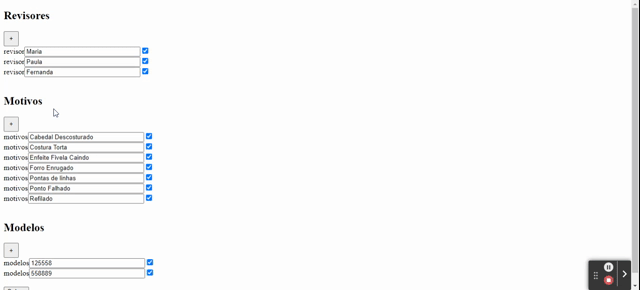

## Descrição do Projeto

O quality-control-system é uma solução para aprimorar o controle de qualidade na revisão de cabedais. Desenvolvido para a indústria de calçados, o sistema oferece uma abordagem eficiente e precisa na identificação de defeitos em cabedais. Com uma interface intuitiva, os revisores podem facilmente registrar modelos, tipos de defeitos e quantidades associadas, proporcionando uma gestão abrangente do processo de inspeção.

## Tela da Revisao

## Tela para adicionar Registros

## Instalação

Siga as etapas abaixo para instalar e executar o projeto em sua máquina local:

Clone este repositório em sua máquina local:

    git clone <URL_DO_REPOSITORIO>

Instale as dependências do projeto usando o npm:

    npm install

Configure as variáveis de ambiente:

Crie um arquivo .env na raiz do projeto e defina as seguintes variáveis de ambiente:

    USER=seu_usuario_do_PostgreSQL
    
    HOST=seu_host_do_PostgreSQL
    
    DATABASE=seu_nome_do_banco_de_dados
    
    PASSWORD=sua_senha_do_PostgreSQL
    
    PORT=porta_do_PostgreSQL

Substitua os valores acima pelos valores correspondentes do seu ambiente PostgreSQL.

Inicie o servidor:

    npm start

O servidor será iniciado e estará pronto para receber solicitações.

Acesse os painéis de monitoramento:

Abra o navegador e acesse as seguintes URLs para acompanhar a produção das células:

Acesse para fazer a revisão: http://localhost:3000

Acesse para registrar cabedais, modelos e revisoras: http://localhost:3000/registro

Se o arquivo JSON não tiver sido gerado ou estiver vazio, os painéis retornarão valores zerados.

Dependências

 - Express.js
  - Axios
  - Dotenv
  - EJS
  - PostgreSQL (pg)
  - path
  - sequelize
